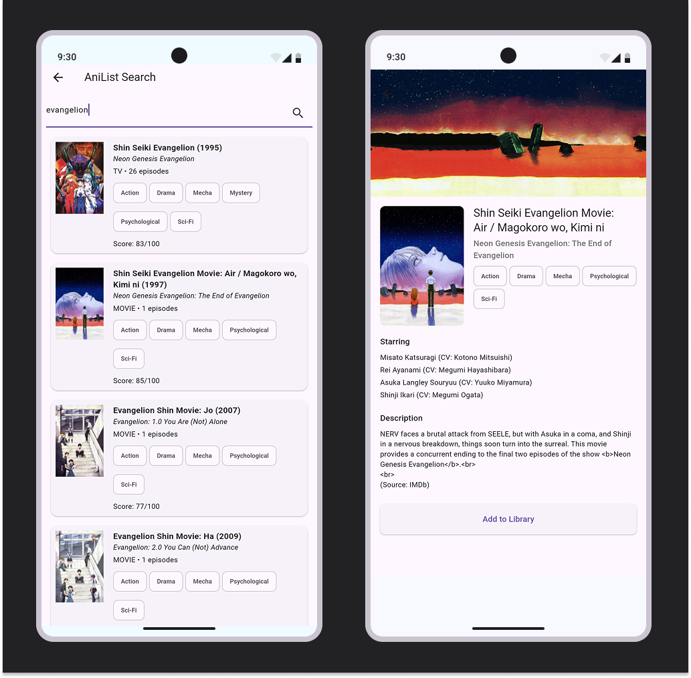

# ChronoReel

ChronoReel is your ultimate watchlist management app that helps you organize and track your entertainment across all mediums. From anime and manga to movies and series, keep everything you want to watch, read, or catch up on in one beautifully organized place.

## Screenshots

## Features

### 📺 Universal Watchlist Management
- Track anime, manga, manhwa, movies, and TV series all in one place
- Organize your content with custom lists and categories
- Mark items as watching, completed, planned, or dropped

### 🔍 Comprehensive Search & Discovery
- Search across multiple databases with AniList and IMDb integration
- Discover new content with personalized recommendations
- Rich metadata including ratings, genres, and detailed descriptions

### 📊 Progress Tracking
- Track your watching/reading progress for ongoing series
- Visual progress indicators and completion statistics
- Never lose track of where you left off

### 🎯 Smart Organization
- Custom tags and categories for personalized organization
- Filter and sort your lists by various criteria
- Quick access to currently watching/reading content

## Tech Stack

- **Frontend**: Flutter
- **Backend**: Supabase
- **APIs**: AniList API, IMDb API
- **Database**: Supabase PostgreSQL

## Usage

1. **Setup**: Create your account and connect your existing AniList profile (optional)
2. **Add Content**: Search and add anime, manga, movies, or series to your lists
3. **Track Progress**: Update your progress as you watch or read
4. **Discover**: Explore new content based on your preferences and ratings

## Contributing

Contributions are welcome! Please feel free to submit issues, feature requests, or pull requests.

1. Fork the repository
2. Create your feature branch (`git checkout -b feature/AmazingFeature`)
3. Commit your changes (`git commit -m 'Add some AmazingFeature'`)
4. Push to the branch (`git push origin feature/AmazingFeature`)
5. Open a Pull Request

**Note**: This app integrates with third-party APIs (AniList, IMDb) and requires internet connectivity for full functionality.